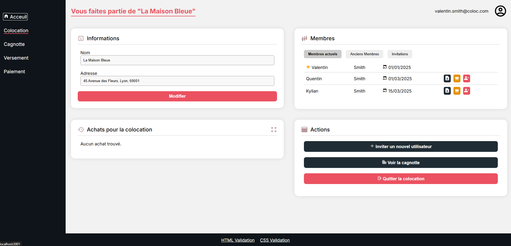

# Colocation

## Description
Projet mettant en application les connaissances Web et Base de données acquises à l'ENSEIRB-Matmeca.

## URL
https://coloc.valentinraillard.fr

## Preview



# Installation et exécution de l'application web

## Docker

### Configuration de base

Assurez-vous d’avoir Docker et Docker Compose installés sur votre machine.

Vous pouvez modifier le fichier `docker-compose.yml` pour changer le nom de la base de données, l'utilisateur, le mot de passe ou l'URL du backend ainsi que l'ensemble des ports.

Par défaut :
- Le backend est accessible sur le port 5000.
- Le frontend est accessible sur le port 3000 (http://localhost:3000).

```bash
docker-compose up -d
```

### Développement
Un fichier `docker-compose.dev.yml` est également disponible pour le développement.

```bash
docker-compose -f docker-compose.dev.yml up -d
```

## Installation manuelle

Pour lancer le backend, vous aurez besoin d'installer [bun.sh](https://bun.sh/docs/installation) puis exécuter la commande suivante :
```bash
cd back
bun run index.ts
```

Pour lancer le frontend en mode développement :
```bash
cd front-vue
bun run dev -o
```

Pour générer le frontend dans le répertoire `/front-vue/build` :
```bash
bun run generate
```

N'oubliez pas de configurer une connexion à une base de données PostgreSQL dans le fichier `/back/.env`.

# Technologies utilisées

## Frontend
- **Vue.js / Nuxt.js 3** : Framework JavaScript progressif pour la création d'interfaces utilisateur.
- **TypeScript** : Surensemble de JavaScript avec typage statique.

## Backend
- **Bun.js** : Runtime JavaScript.
- **TypeScript** : Utilisé pour le code backend.
- **PostgreSQL** : Système de gestion de base de données relationnelle.

## Outils de développement
- **Docker** : Pour la gestion de la base de données et le déploiement.
- **Git/GitHub** : Gestion de versions et collaboration, notamment avec les issues et pull requests. (Un certain manque d'issues et de pull requests utiles à Thor reste à combler !)